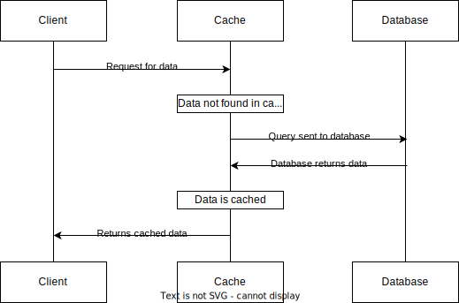
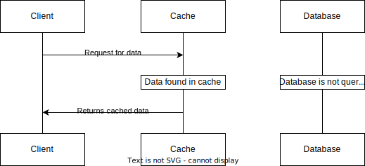
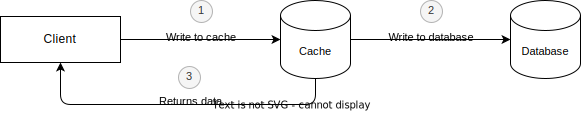
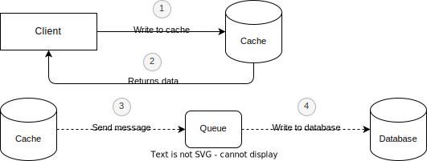

# Caching and its benefits and risks

## Introduction

Nowadays, the cache is everywhere around us, in our browser, on the phone, and in operating systems.
Most of the applications we use implement caching under the hood.
This mechanism is very useful, but it can also cause many problems for developers
since it is considered one of the most complex topics in computer science

So what's actually caching and what's about it that developers so often are eager to implement cache-based layers in
their solutions and when it becomes rather a problem?
I will break it down in this article.

## How it works

Caching is a process that stores multiple copies of data in temporary storage, so they can be accessed faster.
The most common medium where the cached data is stored is RAM.

When a client attempts to access the resource we can distinguish between two scenarios.
A simplified caching pattern is presented in the diagrams below:

Data isn’t found in the cache and it is pulled from the database, it is called a **cache miss**

Data is found in the cache and there is no need to access the database, it is called a **cache hit**

The percent of attempts that result in a cache hit is called the **cache hit rate**.
It's important indicator since it allows you to measure if your cache is working properly and efficiently,
but many people forget that it is not the only one.
For example in the case of distributed caching systems, querying the database may be more efficient than searching for
the next node.

Two significant concepts are also worth discussing here.
The state in which the cache is full and running is called **hot cache**.
The cache may be empty and the query execution takes longer because the cache must first be filled before sending the
answer to the user.
This state is called **cold cache**

### Types of caching

Another essential design choice when caching is whether to have a static or dynamic caching solution.

**Static caching** works well when we know in advance what data the user will need.
An example may be some statistical data for a given month, which no longer changes over time e.g.
the company's profit and loss in the previous month.

**Dynamic caching** is a good choice when the data cannot be stored as static because it is updated over time.
This solution is more common and requires more attention and time to maintain.

## Cache consistency and invalidation

Now that you know what a dynamic cache is, we can start to wonder what if the database state changes?
Will the client get outdated data? Maintaining data consistency is by far the biggest disadvantage that comes with
caching.

### Consistency models

Consistency models range from strong to weak.
The trade-off for having a strong consistency model is that it is generally slower
and more demanding to implement but in some cases, it might be inevitable, especially when
one of the requirements is concurrent transactions (e.g.
banking institutions).

The weaker the consistency model, the easier it is to build a scalable
solution. Weak models fit best in the environments where **eventual consistency** occurs
which means that if no updates are made to a data item, then all replicas of the item will
eventually have the latest updated value. Such a scenario is very common in event-driven applications.
Here is a very comprehensive [example](https://docs.redis.com/latest/rs/concepts/data-access/consistency-durability/)
which can help you understand the differences between strict and weak consistency:

**Cache invalidation** is a process where the entries inside the cache declared as invalid are replaced or completely
removed.
Unfortunately, there is no global solution.

### Write-through cache

This solution straightforwardly provides strict consistency,
when a client sends a request, the data is saved to the cache and to the database at the same time.
Although this solution minimizes the risk of data loss, it may create a performance bottleneck, because the write
operation is performed two times.
That's why write-through caches are not popular.

### Write-behind cache

Another solution is very similar to the previous one, the difference is how the main database is updated.
The data is updated only in the cache and an update to the main database is performed asynchronously at a later time.

Note: We can use a message broker to achieve such a result. When the cache is being updated we can produce the message
and the consumer,
after receiving the message,
performs projections and asynchronously updates the database. This approach represents weak consistency

### Using TTL (Time To Live)

It may happen that we don't need to update particular keys so often or some requests
produce superfluous data.
Using TTL we can keep data from getting too stale.
After the timeout has expired, the keys will be automatically deleted.
It allows you to avoid cluttering up the cache with extra data.
Combining one of the above methods with TTL also allows you to keep the data more consistently
because we are sure that the keys will be eventually removed.

Visible spikes in database-side traffic are caused by the cache having to remove old data and fetch the new one.
In some cases, this can turn out to be a bottleneck in the architecture.
Such load can lead to a significant delay of your database.

## Cache eviction policies

**Key eviction** is a process when old data is being replaced while new data is being added if the cache's maximum size
is reached.
It is convenient behavior since it allows you to keep your cache's size stable.

These are the most popular algorithms supported by many stores that support caching:

### Least Recently Used (LRU):

This algorithm keeps the most recently used keys and removes the least recently used ones.
The general use case is when users will access the most recent items and never or very lately try to
access the old ones.

### Least Frequently Used (LFU):

This algorithm keeps frequently used keys and removes the least frequently used ones.
It fits great when the access patterns for particular keys don't change often and
users will access some items much more frequently than others.

Note: Although these algorithms are effective and are O(n) in space, most often their implementation includes
at least two collections of length n (LRU uses 2, LFU uses 3). That's why they may cause problems with larger sets of
data.
Due to that fact, modern caching stores implemented modified versions of the above solutions:

- **Redis**: https://redis.io/docs/manual/eviction/
- **Memcached**: https://memcached.org/blog/modern-lru/

## Cache benefits

- **Optimization of infrastructure costs**:
  caching can positively affect the costs of the entire network, traffic is reduced because the cache layer is in front
  of our server.
  Additionally, querying the database can generate high costs, especially in cloud environments
- **Better possibilities of using the existing hardware**:
  we can use the computing resources of the main servers to perform more resource-intensive operations, e.g. handling
  queries, streaming, or data analysis
- **Better response times**:
  caching allows you to create low-latency systems and improve general user experience, response times of such systems
  may vary between 20 and 30 milliseconds,
  if the application also uses the browser cache our response times are practically immediate, amounting to about 1 ms
- **Increased availability during systems interruptions**:
  during temporary unavailability of the main servers, the cache may prevent users from experiencing any immediate
  problems,
  at least until they try to save new data

## Cache risks

Using caching brings benefits. People tend to think you always should cache cacheable content,
but as you may have noticed,
caching can also create problems. In particular cases, it can even slow your system down.
Before deciding whether and how to implement caching in your application you should consider these factors that come
into play:

- **Cache hit rate**:
  the low hit rate can actually slow your system down.
  There is no perfect scenario when this happens, in some cases a lower hit rate may cause problems but may not.
  Therefore, it is important to regularly monitor the application traffic and properly select what we want and what we
  do not want to cache
- **Invalidation frequency**:
  too frequent invalidation of particular objects can add complex logic, reduce data consistency,
  and increase the main database's traffic. Constantly changing values shouldn't be cached.
- **Eviction policy**:
  it is recommended to choose an invalidation policy
  depending on the data access patterns and frequency,
  Using such a policy allows us to add new keys to our cache, regardless of its size.
- **Cache size**:
  the size of the cache has to be a compromise between available RAM in the
  server where it is placed, and the size needed to make the cache efficient enough.
  A wrongly configured cache size can lead to slower performance of the entire system.
- **Maximum and minimum objects' size**:
  you should consider the size of the objects that will be saved to the cache.
  Holding small objects may turn out to be suboptimal, while objects that are too large may unnecessarily take up too
  much memory, making it impossible to add new ones without eviction.
- **TTL (Time to Live)**:
  it's similar to the size of objects, TTL should be well-chosen, as keeping something too short can result in
  suboptimal spikes in database-side traffic.
  On the other hand, too long TTL can cause problems with the consistency of our data
- **Data security**: cached data can expose critical data to intruders, if the data we store is confidential and
  sensitive, we should take care of additional security during caching.

## Conclusions

In this article, I discussed what caching is, explained the basic concepts that often appear together with this subject.
I introduced you to the basic algorithms and methods of caching, and listed the advantages and most important risks that
a conscious application developers like you should be aware of in order to better monitor and increase the performance
of their applications. 

